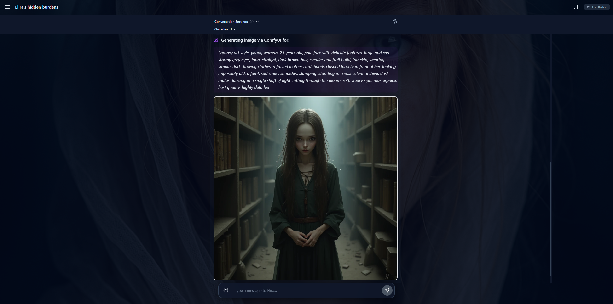

<div align="center">


# 🎭 RolyGem

**منصة الجيل القادم للعب الأدوار بالذكاء الاصطناعي مع تطور ديناميكي للشخصيات**

[](LICENSE)
[](https://www.typescriptlang.org/)
[](https://react.dev/)
[](https://ai.google.dev/)

[✨ المميزات](#-المميزات) • [🚀 البدء السريع](#-البدء-السريع) • [📚 التوثيق](#-التوثيق) • [🤝 المساهمة](#-المساهمة)

</div>

---

## 🌟 ما هو RolyGem؟

**RolyGem** هي منصة متقدمة للعب الأدوار مدعومة بالذكاء الاصطناعي تُحيي الشخصيات من خلال أنظمة ذكية واعية بالسياق. على عكس روبوتات الدردشة التقليدية، يتميز RolyGem بـ**وكلاء ذكاء اصطناعي مستقلين** يطورون الشخصيات ديناميكياً، ويحقنون الأحداث الدرامية، ويحافظون على الاستمرارية العاطفية طوال قصصك.

### 🎯 لماذا RolyGem؟

- **🧠 شخصيات حية**: الشخصيات تتذكر، تتطور، وتنمو بناءً على أحداث القصة
- **🎬 المخرج الذكي (Director AI)**: نظام تدخل درامي مستقل يحافظ على جاذبية القصص
- **💭 محرك الحالة الواعية**: يتتبع الحالات العاطفية وديناميكيات الشخصيات في الوقت الفعلي
- **📖 كتب المعرفة الذكية**: حقن المعرفة الواعية بالسياق مع RAG embeddings
- **🎨 متعدد الوسائط**: توليد صور متكامل مع عدة backends
- **🌐 جاهز كـ PWA**: يعمل بدون اتصال كتطبيق ويب تقدمي
- **🔒 الخصوصية أولاً**: جميع البيانات مخزنة محلياً في IndexedDB

---

## ✨ المميزات

### 🤖 **أنظمة الذكاء الاصطناعي المستقلة**

#### **المخرج الذكي (Director AI)** - تنسيق القصة الذكي
- **الوضع الذكي**: تدخل درامي واعٍ بالسياق
- **وضع التكرار**: أحداث تقليدية بناءً على فترات زمنية
- يحقن تلقائياً تقلبات الحبكة، الصراعات، واللحظات الدرامية
- محفزات وشدة تدخل قابلة للتخصيص

#### **المعرفة الحية (Living Lore)** - تطور الشخصية الديناميكي
- يكتشف لحظات تطور الشخصية المهمة
- يقترح تحديثات تلقائية لملفات الشخصيات
- يتتبع تغيرات الشخصية، العلاقات، والنمو
- تسجيل ذكي للأهمية (0-100) لاكتشاف الأحداث

#### **محرك الحالة الواعية (Conscious State Engine)** - الذكاء العاطفي
- تتبع الحالة العاطفية في الوقت الفعلي لجميع الشخصيات
- يراقب العلاقات، التوترات، والديناميكيات
- تحديثات قائمة على Delta لإدارة فعالة للحالة
- محرك V2 مع تحليل عاطفي محسّن

#### **محرك الإرادة (Will Engine)** - سرديات موجهة بالأهداف
- تتبع أهداف الشخصيات ومراقبة التقدم
- توليد فرص تلقائي (آليات الانزلاق)
- اكتشاف تحقيق الأهداف الواعي بالسياق
- استراتيجيات تدخل ذكية (تلميح/مشهد/انتظار)

### 💬 **ميزات الدردشة المتقدمة**

- **دعم الشخصيات المتعددة**: محادثات جماعية سلسة مع شخصيات متعددة
- **التحكم في الردود**: تعديلات درجة الحرارة، top-p، والأسلوب لكل رسالة
- **التعليمات الفورية**: معدلات سريعة للنبرة، الأسلوب، والتركيز
- **وضع الرد المزدوج**: قارن الردود من نماذج ذكاء اصطناعي مختلفة
- **تنويعات الرسائل**: توليد ومقارنة خيارات ردود متعددة
- **إدارة السياق الذكية**: تلخيص تلقائي للمحادثات الطويلة
- **نظام التمهيد**: رسائل تفكير Gemini 2.5 Pro للإعداد الدرامي

### 🎨 **توليد الصور**

دعم backends متعددة:
- **ComfyUI**: سير عمل متقدمة وعقد مخصصة
- **Stable Diffusion WebUI**: توليد محلي مع A1111/Forge
- **Hugging Face**: توليد سحابي
- **XAI (Grok)**: توليد سريع مع نموذج Aurora

المميزات:
- تحسين تلقائي للـ prompts
- توليد خلفيات المشاهد
- اتساق مظهر الشخصيات
- دعم ADetailer لتحسين الوجوه

### 📚 **إدارة المعرفة**

- **كتب المعرفة الذكية**: حقن السياق مدعوم بـ RAG
- **ملفات الشخصيات**: ملفات تفصيلية مع العلاقات والسمات
- **بناء العالم**: الأقواس، المواقع، وتتبع القصص
- **تضمينات الذاكرة**: بحث متجه HNSW مع Tigris
- **التلخيص التلقائي**: تقييم أهمية المشاهد واستخراجها

### 🎵 **ميزات إضافية**

- **توليد الأغاني**: إنشاء موسيقى واعية بالسياق عبر Suno
- **ملفات الهوية**: إدارة شخصيات مستخدم متعددة
- **بوت تيليجرام**: وصول عن بُعد لنسخة RolyGem الخاصة بك
- **نظام الثيمات**: أوضاع داكنة/فاتحة مع ألوان مخصصة
- **التحكم في أسلوب الكتابة**: توازن السرد/الحوار، إعدادات الوكالة
- **التصدير/الاستيراد**: نسخ احتياطي واستعادة المحادثات والبيانات

---

## 🚀 البدء السريع

### المتطلبات الأساسية

- **Node.js** 18+ (موصى به: 20+)
- **Gemini API Key** ([احصل على واحد مجاناً](https://aistudio.google.com/apikey))

### التثبيت

```bash
# استنساخ المستودع
git clone git@github.com:RolyGem/RolyGem.git
cd RolyGem

# تثبيت التبعيات
npm install

# إنشاء ملف البيئة
cp .env.example .env.local

# أضف مفتاح Gemini API الخاص بك إلى .env.local
VITE_GEMINI_API_KEY=your_api_key_here
```

### تشغيل التطبيق

**وضع التطوير:**
```bash
npm run dev
# افتح http://localhost:5173
```

**وضع الإنتاج (موصى به لـ PWA):**
```bash
npm run prod
# يبني ويخدم على http://localhost:5173
```

**بناء الإنتاج:**
```bash
npm run build
npm start
```

### الخطوات الأولى

1. **إضافة مفاتيح API**: اذهب إلى الإعدادات → مفاتيح API وأضف مفتاح Gemini API الخاص بك
2. **إنشاء شخصية**: الإعدادات → الشخصيات → إضافة شخصية
3. **بدء محادثة**: أنشئ دردشة جديدة واختر شخصيتك
4. **تفعيل الوكلاء**: الإعدادات → الوكلاء → فعّل المخرج الذكي والمعرفة الحية

---

## 📚 التوثيق

أدلة شاملة متوفرة في مجلد `docs/`:

| المستند | الوصف |
|----------|-------------|
| **[نظرة عامة](docs/OVERVIEW.md)** | بنية المنصة، نموذج البيانات، والمفاهيم الأساسية |
| **[البدء السريع](docs/QUICK-START.md)** | ابدأ في 5 دقائق |
| **[المميزات](docs/FEATURES.md)** | قائمة شاملة بالمميزات مع أمثلة الاستخدام |
| **[الوكلاء](docs/AGENTS.md)** | أنظمة وكلاء الذكاء الاصطناعي (المخرج الذكي، المعرفة الحية، محرك الحالة الواعية، محرك الإرادة) |
| **[توليد الصور](docs/IMAGE-GENERATION.md)** | الإعداد والتكوين لـ backends الصور |
| **[الإعدادات](docs/SETTINGS.md)** | دليل الإعدادات الشامل |

---

## 🛠️ المجموعة التقنية

- **الواجهة الأمامية**: React 19, TypeScript, TailwindCSS
- **الذكاء الاصطناعي**: Google Gemini 2.5 (Flash, Pro, Flash Lite)
- **إدارة الحالة**: React Hooks, IndexedDB (Dexie)
- **البحث المتجه**: HNSW (hnswlib-wasm), Tigris Vector
- **أداة البناء**: Vite
- **PWA**: Service Worker, Web App Manifest

---

## 🎨 لقطات الشاشة

### واجهة الدردشة

*واجهة الدردشة الرئيسية مع محادثات الشخصيات والميزات المتقدمة*

### توليد الصور

*توليد صور مدعوم بالذكاء الاصطناعي مع دعم backends متعددة*

---

## 💡 رسالة من المطور

**هذه المنصة ما زالت تتطور.** نشرتها مبكراً لأنني لا أستطيع حل مشكلة التلخيص الهرمي وحدي — أريد من مجتمع المصدر المفتوح أن يساعد في بناء أول محرك سياق مستقر.

أنا طالب أعمل على هذا المشروع بمفردي. RolyGem كان جهداً فردياً حتى الآن، ورغم أنني نفذت الكثير من الميزات، لا أستطيع إصلاح كل شيء بنفسي. لدي أفكار لجعل تجربة المستخدم أكثر تقدماً من خلال **هندسة السياق** و**التحكم المطلق**، لكنني أحتاج مساعدتك لتحويلها إلى حقيقة.

### 🙏 المجالات التي أحتاج فيها المساعدة

إذا كان لديك خبرة في:
- **التلخيص الهرمي**: ضغط السياق متعدد المستويات دون فقدان تماسك القصة
- **معالجة القطع (Chunks)**: تقسيم فعال للرسائل في المحادثات الطويلة
- **نماذج اللغة طويلة السياق**: تحسين نوافذ السياق وإدارة الرموز (Tokens)
- **هندسة السياق**: أنظمة ذكية لتجميع السياق وتحديد الأولويات
- **أداء React**: تحسين مجموعات بيانات IndexedDB الكبيرة والتمرير الافتراضي

...مساهمتك ستعني **الكثير**. حتى التحسينات الصغيرة تحدث فرقاً كبيراً.

### 💬 نصيحة للمستخدمين

استخدم **التعليمات الفورية (Instant Instructions)** بشكل متكرر في محادثاتك! إنها واحدة من أقوى الميزات للتحكم في سلوك الذكاء الاصطناعي بشكل فوري دون تغيير الإعدادات العامة.

---

## 🤝 المساهمة

RolyGem **مفتوح المصدر** تحت AGPL-3.0! جميع المساهمات مرحب بها.

### إعداد التطوير

1. انسخ المستودع (Fork)
2. أنشئ فرع ميزة (`git checkout -b feature/amazing-feature`)
3. أرسل تغييراتك (`git commit -m 'Add amazing feature'`)
4. ادفع إلى الفرع (`git push origin feature/amazing-feature`)
5. افتح Pull Request

### أسلوب الكود

- TypeScript strict mode
- ESLint + Prettier للتنسيق
- مكونات React وظيفية مع hooks
- أسماء متغيرات وصفية

---

## 📄 الترخيص

هذا المشروع مرخص تحت **GNU Affero General Public License v3.0** - انظر ملف [LICENSE](LICENSE) للتفاصيل.

**ماذا يعني هذا:**
- ✅ يمكنك استخدام، تعديل، وتوزيع هذا البرنامج بحرية
- ✅ إذا قمت بتشغيل نسخة معدلة على خادم، **يجب** عليك مشاركة الكود المصدري
- ✅ أي تعديلات يجب أن تكون مرخصة أيضاً تحت AGPL-3.0
- ✅ مثالي لمشاريع الذكاء الاصطناعي مفتوحة المصدر والتطوير المجتمعي

---

## 🙏 الشكر والتقدير

- **فريق Google Gemini** على نماذج الذكاء الاصطناعي القوية
- **مجتمع المصدر المفتوح** على المكتبات والأدوات الرائعة
- **المساهمون** الذين يساعدون في جعل RolyGem أفضل

---

## 🔗 الروابط

- **GitHub**: [https://github.com/RolyGem/RolyGem](https://github.com/RolyGem/RolyGem)
- **المشاكل**: [أبلغ عن أخطاء أو اطلب ميزات](https://github.com/RolyGem/RolyGem/issues)
- **النقاشات**: [انضم إلى المجتمع](https://github.com/RolyGem/RolyGem/discussions)
- **Discord**: *قريباً*

---

<div align="center">

**صُنع بـ ❤️ لمجتمع لعب الأدوار بالذكاء الاصطناعي**

⭐ ضع نجمة لنا على GitHub إذا وجدت RolyGem مفيداً!

</div>
